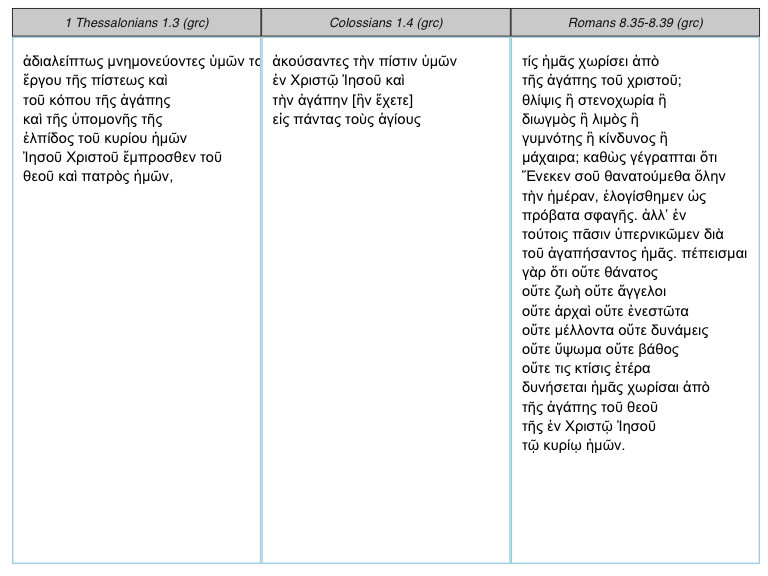

<!-- README.md is generated from README.Rmd. Please edit that file -->
rperseus
--------

------------------------------------------------------------------------

[](https://travis-ci.org/ropensci/rperseus) [](https://codecov.io/gh/ropensci/rperseus) [](https://github.com/ropensci/onboarding/issues/145)


Author: David Ranzolin

License: MIT

Goal
----

The goal of `rperseus` is to furnish classicists, textual critics, and R enthusiasts with texts from the Classical World. While the English translations of most texts are available through `gutenbergr`, `rperseus`returns these works in their original language--Greek, Latin, and Hebrew.

Description
-----------

`rperseus` provides access to classical texts within the [Perseus Digital Library's](http://www.perseus.tufts.edu/hopper/) CapiTainS environment. A wealth of Greek, Latin, and Hebrew texts are available, from Homer to Cicero to Boetheius. The Perseus Digital Library includes English translations in some cases. The base API url is `http://cts.perseids.org/api/cts`.

Installation
------------

`rperseus` is not on CRAN, but can be installed via:

``` r
devtools::install_github("ropensci/rperseus")
```

Usage
-----

[See the vignette to get started.](https://daranzolin.github.io/rperseus//articles/rperseus-vignette.html)

To obtain a particular text, you must first know its full Uniform Resource Name (URN). URNs can be perused in the `perseus_catalog`, a data frame lazily loaded into the package. For example, say I want a copy of Virgil's *Aeneid*:

``` r
library(dplyr)
library(purrr)
library(rperseus)

aeneid_latin <- perseus_catalog %>% 
  filter(group_name == "Virgil",
         label == "Aeneid",
         language == "lat") %>% 
  pull(urn) %>% 
  get_perseus_text()
```

You can also request an English translation for some texts:

``` r
aeneid_english <- perseus_catalog %>% 
  filter(group_name == "Virgil",
         label == "Aeneid",
         language == "eng") %>% 
  pull(urn) %>% 
  get_perseus_text()
```

Refer to the language variable in `perseus_catalog` for translation availability.

Excerpts
--------

You can also specify excerpts:

``` r
qoheleth <- get_perseus_text(urn = "urn:cts:ancJewLit:hebBible.ecclesiastes.leningrad-pntd", excerpt = "1.1-1.3")
qoheleth$text
#> [1] "דִּבְרֵי֙ קֹהֶ֣לֶת בֶּן־ דָּוִ֔ד מֶ֖לֶךְ בִּירוּשָׁלִָֽם : הֲבֵ֤ל הֲבָלִים֙ אָמַ֣ר קֹהֶ֔לֶת הֲבֵ֥ל הֲבָלִ֖ים הַכֹּ֥ל הָֽבֶל : מַה־ יִּתְר֖וֹן לָֽאָדָ֑ם בְּכָל־ עֲמָל֔וֹ שֶֽׁיַּעֲמֹ֖ל תַּ֥חַת הַשָּֽׁמֶשׁ :"
```

Parsing Excerpts
----------------

You can parse any Greek excerpt, returning a data frame with each word's part of speech, gender, case, mood, voice, tense, person, number, and degree.

``` r
knitr::kable(parse_excerpt("urn:cts:greekLit:tlg0031.tlg002.perseus-grc2", "5.1-5.2"))
```

| word         | form           | verse | part\_of\_speech | person | number   | tense     | mood        | voice         | gender    | case       | degree |
|:-------------|:---------------|:------|:-----------------|:-------|:---------|:----------|:------------|:--------------|:----------|:-----------|:-------|
| καί          | Καὶ            | 5.1   | conjunction      | NA     | NA       | NA        | NA          | NA            | NA        | NA         | NA     |
| ἔρχομαι      | ἦλθον          | 5.1   | verb             | third  | plural   | aorist    | indicative  | active        | NA        | NA         | NA     |
| εἰς          | εἰς            | 5.1   | preposition      | NA     | NA       | NA        | NA          | NA            | NA        | NA         | NA     |
| ὁ            | τὸ             | 5.1   | article          | NA     | singular | NA        | NA          | NA            | neuter    | accusative | NA     |
| πέραν        | πέραν          | 5.1   | adverb           | NA     | NA       | NA        | NA          | NA            | NA        | NA         | NA     |
| ὁ            | τῆς            | 5.1   | article          | NA     | singular | NA        | NA          | NA            | feminine  | genative   | NA     |
| θάλασσα      | θαλάσσης       | 5.1   | noun             | NA     | singular | NA        | NA          | NA            | feminine  | genative   | NA     |
| εἰς          | εἰς            | 5.1   | preposition      | NA     | NA       | NA        | NA          | NA            | NA        | NA         | NA     |
| ὁ            | τὴν            | 5.1   | article          | NA     | singular | NA        | NA          | NA            | feminine  | accusative | NA     |
| χώρα         | χώραν          | 5.1   | noun             | NA     | singular | NA        | NA          | NA            | feminine  | accusative | NA     |
| ὁ            | τῶν            | 5.1   | article          | NA     | plural   | NA        | NA          | NA            | masculine | genative   | NA     |
| Γερασηνός    | Γερασηνῶν      | 5.1   | noun             | NA     | plural   | NA        | NA          | NA            | masculine | genative   | NA     |
| .            | .              | 5.1   | punctuation      | NA     | NA       | NA        | NA          | NA            | NA        | NA         | NA     |
| καί          | καὶ            | 5.2   | adverb           | NA     | NA       | NA        | NA          | NA            | NA        | NA         | NA     |
| ἐξέρχομαι    | ἐξελθόντος     | 5.2   | verb             | NA     | singular | aorist    | participle  | active        | masculine | genative   | NA     |
| αὐτός        | αὐτοῦ          | 5.2   | adverb           | NA     | NA       | NA        | NA          | NA            | NA        | NA         | NA     |
| ἐκ           | ἐκ             | 5.2   | preposition      | NA     | NA       | NA        | NA          | NA            | NA        | NA         | NA     |
| ὁ            | τοῦ            | 5.2   | article          | NA     | singular | NA        | NA          | NA            | neuter    | genative   | NA     |
| πλοῖον       | πλοίου         | 5.2   | noun             | NA     | singular | NA        | NA          | NA            | neuter    | genative   | NA     |
| \[           | \[             | 5.2   | punctuation      | NA     | NA       | NA        | NA          | NA            | NA        | NA         | NA     |
| εὐθύς        | εὐθὺς          | 5.2   | adverb           | NA     | NA       | NA        | NA          | NA            | NA        | NA         | NA     |
| \]           | \]             | 5.2   | punctuation      | NA     | NA       | NA        | NA          | NA            | NA        | NA         | NA     |
| ὑπαντάω      | ὑπήντησεν      | 5.2   | verb             | third  | singular | aorist    | indicative  | active        | NA        | NA         | NA     |
| αὐτός        | αὐτῷ           | 5.2   | pronoun          | NA     | singular | NA        | NA          | NA            | masculine | dative     | NA     |
| ἐκ           | ἐκ             | 5.2   | preposition      | NA     | NA       | NA        | NA          | NA            | NA        | NA         | NA     |
| ὁ            | τῶν            | 5.2   | article          | NA     | plural   | NA        | NA          | NA            | masculine | genative   | NA     |
| NA           | μνημείων       | 5.2   | adjective        | NA     | plural   | NA        | NA          | NA            | masculine | genative   | NA     |
| ἄνθρωπος     | ἄνθρωπος       | 5.2   | noun             | NA     | singular | NA        | NA          | NA            | masculine | nominative | NA     |
| ἐν           | ἐν             | 5.2   | preposition      | NA     | NA       | NA        | NA          | NA            | NA        | NA         | NA     |
| πνεῦμα       | πνεύματι       | 5.2   | noun             | NA     | singular | NA        | NA          | NA            | neuter    | dative     | NA     |
| ἀκάθαρτος    | ἀκαθάρτῳ       | 5.2   | adjective        | NA     | singular | NA        | NA          | NA            | neuter    | dative     | NA     |
| ,            | ,              | 5.2   | punctuation      | NA     | NA       | NA        | NA          | NA            | NA        | NA         | NA     |
| NA           | Ἦν             | 5.11  | pronoun          | first  | singular | NA        | NA          | NA            | feminine  | accusative | NA     |
| δέ           | δὲ             | 5.11  | particle         | NA     | NA       | NA        | NA          | NA            | NA        | NA         | NA     |
| ἐκεῖ         | ἐκεῖ           | 5.11  | adverb           | NA     | NA       | NA        | NA          | NA            | NA        | NA         | NA     |
| πρός         | πρὸς           | 5.11  | preposition      | NA     | NA       | NA        | NA          | NA            | NA        | NA         | NA     |
| ὁ            | τῷ             | 5.11  | article          | NA     | singular | NA        | NA          | NA            | neuter    | dative     | NA     |
| ὄρος         | ὄρει           | 5.11  | noun             | NA     | singular | NA        | NA          | NA            | neuter    | dative     | NA     |
| NA           | ἀγέλη          | 5.11  | adjective        | NA     | singular | NA        | NA          | NA            | neuter    | dative     | NA     |
| NA           | χοίρων         | 5.11  | verb             | NA     | singular | present   | participle  | active        | masculine | nominative | NA     |
| μέγας        | μεγάλη         | 5.11  | adjective        | NA     | singular | NA        | NA          | NA            | feminine  | nominative | NA     |
| βόσκω        | βοσκομένη      | 5.11  | verb             | NA     | singular | present   | participle  | medio-passive | feminine  | nominative | NA     |
| ·            | ·              | 5.11  | punctuation      | NA     | NA       | NA        | NA          | NA            | NA        | NA         | NA     |
| καί          | καὶ            | 5.12  | adverb           | NA     | NA       | NA        | NA          | NA            | NA        | NA         | NA     |
| παρακαλέω    | παρεκάλεσαν    | 5.12  | verb             | third  | plural   | aorist    | indicative  | active        | NA        | NA         | NA     |
| αὐτός        | αὐτὸν          | 5.12  | pronoun          | NA     | singular | NA        | NA          | NA            | masculine | accusative | NA     |
| λέγω         | λέγοντες       | 5.12  | verb             | NA     | plural   | present   | participle  | active        | masculine | nominative | NA     |
| NA           | Πέμψον         | 5.12  | noun             | NA     | singular | NA        | NA          | NA            | masculine | accusative | NA     |
| ἐγώ          | ἡμᾶς           | 5.12  | pronoun          | first  | plural   | NA        | NA          | NA            | masculine | accusative | NA     |
| εἰς          | εἰς            | 5.12  | preposition      | NA     | NA       | NA        | NA          | NA            | NA        | NA         | NA     |
| ὁ            | τοὺς           | 5.12  | article          | NA     | plural   | NA        | NA          | NA            | masculine | accusative | NA     |
| χοῖρος       | χοίρους        | 5.12  | noun             | NA     | plural   | NA        | NA          | NA            | masculine | accusative | NA     |
| ,            | ,              | 5.12  | punctuation      | NA     | NA       | NA        | NA          | NA            | NA        | NA         | NA     |
| ἵνα          | ἵνα            | 5.12  | conjunction      | NA     | NA       | NA        | NA          | NA            | NA        | NA         | NA     |
| εἰς          | εἰς            | 5.12  | preposition      | NA     | NA       | NA        | NA          | NA            | NA        | NA         | NA     |
| αὐτός        | αὐτοὺς         | 5.12  | pronoun          | NA     | plural   | NA        | NA          | NA            | masculine | accusative | NA     |
| εἰσέρχομαι   | εἰσέλθωμεν     | 5.12  | verb             | first  | plural   | aorist    | sunjunctive | active        | NA        | NA         | NA     |
| .            | .              | 5.12  | punctuation      | NA     | NA       | NA        | NA          | NA            | NA        | NA         | NA     |
| καί          | καὶ            | 5.13  | adverb           | NA     | NA       | NA        | NA          | NA            | NA        | NA         | NA     |
| ἐπιτρέπω     | ἐπέτρεψεν      | 5.13  | verb             | third  | singular | aorist    | indicative  | active        | NA        | NA         | NA     |
| αὐτός        | αὐτοῖς         | 5.13  | pronoun          | NA     | plural   | NA        | NA          | NA            | masculine | dative     | NA     |
| .            | .              | 5.13  | punctuation      | NA     | NA       | NA        | NA          | NA            | NA        | NA         | NA     |
| καί          | καὶ            | 5.13  | adverb           | NA     | NA       | NA        | NA          | NA            | NA        | NA         | NA     |
| ἐξέρχομαι    | ἐξελθόντα      | 5.13  | verb             | NA     | singular | aorist    | participle  | active        | masculine | accusative | NA     |
| ὁ            | τὰ             | 5.13  | article          | NA     | plural   | NA        | NA          | NA            | neuter    | accusative | NA     |
| πνεῦμα       | πνεύματα       | 5.13  | noun             | NA     | plural   | NA        | NA          | NA            | neuter    | accusative | NA     |
| ὁ            | τὰ             | 5.13  | article          | NA     | plural   | NA        | NA          | NA            | neuter    | accusative | NA     |
| ἀκάθαρτος    | ἀκάθαρτα       | 5.13  | adjective        | NA     | plural   | NA        | NA          | NA            | neuter    | accusative | NA     |
| εἰσέρχομαι   | εἰσῆλθον       | 5.13  | verb             | third  | plural   | aorist    | indicative  | active        | NA        | NA         | NA     |
| εἰς          | εἰς            | 5.13  | preposition      | NA     | NA       | NA        | NA          | NA            | NA        | NA         | NA     |
| ὁ            | τοὺς           | 5.13  | article          | NA     | plural   | NA        | NA          | NA            | masculine | accusative | NA     |
| χοῖρος       | χοίρους        | 5.13  | noun             | NA     | plural   | NA        | NA          | NA            | masculine | accusative | NA     |
| ,            | ,              | 5.13  | punctuation      | NA     | NA       | NA        | NA          | NA            | NA        | NA         | NA     |
| καί          | καὶ            | 5.13  | conjunction      | NA     | NA       | NA        | NA          | NA            | NA        | NA         | NA     |
| ὁρμάω        | ὥρμησεν        | 5.13  | verb             | third  | singular | aorist    | indicative  | active        | NA        | NA         | NA     |
| ὁ            | ἡ              | 5.13  | article          | NA     | singular | NA        | NA          | NA            | feminine  | nominative | NA     |
| ἀγέλη        | ἀγέλη          | 5.13  | noun             | NA     | singular | NA        | NA          | NA            | feminine  | nominative | NA     |
| κατά         | κατὰ           | 5.13  | preposition      | NA     | NA       | NA        | NA          | NA            | NA        | NA         | NA     |
| ὁ            | τοῦ            | 5.13  | article          | NA     | singular | NA        | NA          | NA            | masculine | genative   | NA     |
| κρημνός      | κρημνοῦ        | 5.13  | noun             | NA     | singular | NA        | NA          | NA            | masculine | genative   | NA     |
| εἰς          | εἰς            | 5.13  | preposition      | NA     | NA       | NA        | NA          | NA            | NA        | NA         | NA     |
| ὁ            | τὴν            | 5.13  | article          | NA     | singular | NA        | NA          | NA            | feminine  | accusative | NA     |
| θάλασσα      | θάλασσαν       | 5.13  | noun             | NA     | singular | NA        | NA          | NA            | feminine  | accusative | NA     |
| ,            | ,              | 5.13  | punctuation      | NA     | NA       | NA        | NA          | NA            | NA        | NA         | NA     |
| ὡς           | ὡς             | 5.13  | conjunction      | NA     | NA       | NA        | NA          | NA            | NA        | NA         | NA     |
| δισχίλιοι    | δισχίλιοι      | 5.13  | adjective        | NA     | plural   | NA        | NA          | NA            | masculine | nominative | NA     |
| ,            | ,              | 5.13  | punctuation      | NA     | NA       | NA        | NA          | NA            | NA        | NA         | NA     |
| καί          | καὶ            | 5.13  | adverb           | NA     | NA       | NA        | NA          | NA            | NA        | NA         | NA     |
| πνίγω        | ἐπνίγοντο      | 5.13  | verb             | third  | plural   | imperfect | indicative  | medio-passive | NA        | NA         | NA     |
| ἐν           | ἐν             | 5.13  | preposition      | NA     | NA       | NA        | NA          | NA            | NA        | NA         | NA     |
| ὁ            | τῇ             | 5.13  | article          | NA     | singular | NA        | NA          | NA            | feminine  | dative     | NA     |
| θάλασσα      | θαλάσσῃ        | 5.13  | noun             | NA     | singular | NA        | NA          | NA            | feminine  | dative     | NA     |
| .            | .              | 5.13  | punctuation      | NA     | NA       | NA        | NA          | NA            | NA        | NA         | NA     |
| καί          | Καὶ            | 5.14  | conjunction      | NA     | NA       | NA        | NA          | NA            | NA        | NA         | NA     |
| ὁ            | οἱ             | 5.14  | article          | NA     | plural   | NA        | NA          | NA            | masculine | nominative | NA     |
| βόσκω        | βόσκοντες      | 5.14  | verb             | NA     | plural   | present   | participle  | active        | masculine | nominative | NA     |
| αὐτός        | αὐτοὺς         | 5.14  | pronoun          | NA     | plural   | NA        | NA          | NA            | masculine | accusative | NA     |
| φεύγω        | ἔφυγον         | 5.14  | verb             | third  | plural   | aorist    | indicative  | active        | NA        | NA         | NA     |
| καί          | καὶ            | 5.14  | adverb           | NA     | NA       | NA        | NA          | NA            | NA        | NA         | NA     |
| ἀπαγγέλλω    | ἀπήγγειλαν     | 5.14  | verb             | third  | plural   | aorist    | indicative  | active        | NA        | NA         | NA     |
| εἰς          | εἰς            | 5.14  | preposition      | NA     | NA       | NA        | NA          | NA            | NA        | NA         | NA     |
| ὁ            | τὴν            | 5.14  | article          | NA     | singular | NA        | NA          | NA            | feminine  | accusative | NA     |
| πόλις        | πόλιν          | 5.14  | noun             | NA     | singular | NA        | NA          | NA            | feminine  | accusative | NA     |
| καί          | καὶ            | 5.14  | adverb           | NA     | NA       | NA        | NA          | NA            | NA        | NA         | NA     |
| εἰς          | εἰς            | 5.14  | preposition      | NA     | NA       | NA        | NA          | NA            | NA        | NA         | NA     |
| ὁ            | τοὺς           | 5.14  | article          | NA     | plural   | NA        | NA          | NA            | masculine | accusative | NA     |
| ἀγρός        | ἀγρούς         | 5.14  | noun             | NA     | plural   | NA        | NA          | NA            | masculine | accusative | NA     |
| ·            | ·              | 5.14  | punctuation      | NA     | NA       | NA        | NA          | NA            | NA        | NA         | NA     |
| καί          | καὶ            | 5.14  | adverb           | NA     | NA       | NA        | NA          | NA            | NA        | NA         | NA     |
| ἔρχομαι      | ἦλθον          | 5.14  | verb             | third  | plural   | aorist    | indicative  | active        | NA        | NA         | NA     |
| ὁράω         | ἰδεῖν          | 5.14  | verb             | NA     | NA       | aorist    | infinitive  | active        | NA        | NA         | NA     |
| τι           | τί             | 5.14  | adverb           | NA     | NA       | NA        | NA          | NA            | NA        | NA         | NA     |
| εἰμί         | ἐστιν          | 5.14  | verb             | third  | singular | present   | indicative  | active        | NA        | NA         | NA     |
| ὁ            | τὸ             | 5.14  | article          | NA     | singular | NA        | NA          | NA            | neuter    | accusative | NA     |
| γίγνομαι     | γεγονός        | 5.14  | verb             | NA     | singular | perfect   | participle  | active        | neuter    | accusative | NA     |
| .            | .              | 5.14  | punctuation      | NA     | NA       | NA        | NA          | NA            | NA        | NA         | NA     |
| καί          | καὶ            | 5.15  | adverb           | NA     | NA       | NA        | NA          | NA            | NA        | NA         | NA     |
| ἔρχομαι      | ἔρχονται       | 5.15  | verb             | third  | plural   | present   | indicative  | medio-passive | NA        | NA         | NA     |
| πρός         | πρὸς           | 5.15  | preposition      | NA     | NA       | NA        | NA          | NA            | NA        | NA         | NA     |
| ὁ            | τὸν            | 5.15  | article          | NA     | singular | NA        | NA          | NA            | masculine | accusative | NA     |
| Ἰησοῦς       | Ἰησοῦν         | 5.15  | noun             | NA     | singular | NA        | NA          | NA            | masculine | accusative | NA     |
| ,            | ,              | 5.15  | punctuation      | NA     | NA       | NA        | NA          | NA            | NA        | NA         | NA     |
| καί          | καὶ            | 5.15  | conjunction      | NA     | NA       | NA        | NA          | NA            | NA        | NA         | NA     |
| NA           | θεωροῦσιν      | 5.15  | noun             | NA     | singular | NA        | NA          | NA            | masculine | accusative | NA     |
| ὁ            | τὸν            | 5.15  | article          | NA     | singular | NA        | NA          | NA            | masculine | accusative | NA     |
| NA           | δαιμονιζόμενον | 5.15  | verb             | NA     | singular | present   | participle  | medio-passive | masculine | accusative | NA     |
| NA           | καθήμενον      | 5.15  | verb             | NA     | singular | perfect   | participle  | medio-passive | masculine | accusative | NA     |
| ἱματίζω      | ἱματισμένον    | 5.15  | verb             | NA     | singular | perfect   | participle  | medio-passive | masculine | accusative | NA     |
| καί          | καὶ            | 5.15  | adverb           | NA     | NA       | NA        | NA          | NA            | NA        | NA         | NA     |
| σωφρονέω     | σωφρονοῦντα    | 5.15  | verb             | NA     | singular | present   | participle  | active        | masculine | accusative | NA     |
| ,            | ,              | 5.15  | punctuation      | NA     | NA       | NA        | NA          | NA            | NA        | NA         | NA     |
| ὁ            | τὸν            | 5.15  | article          | NA     | singular | NA        | NA          | NA            | masculine | accusative | NA     |
| ἔχω          | ἐσχηκότα       | 5.15  | verb             | NA     | singular | perfect   | participle  | active        | masculine | accusative | NA     |
| ὁ            | τὸν            | 5.15  | article          | NA     | singular | NA        | NA          | NA            | masculine | accusative | NA     |
| NA           | λεγιῶνα        | 5.15  | noun             | NA     | singular | NA        | NA          | NA            | masculine | accusative | NA     |
| ,            | ,              | 5.15  | punctuation      | NA     | NA       | NA        | NA          | NA            | NA        | NA         | NA     |
| καί          | καὶ            | 5.15  | adverb           | NA     | NA       | NA        | NA          | NA            | NA        | NA         | NA     |
| φοβέω        | ἐφοβήθησαν     | 5.15  | verb             | third  | plural   | aorist    | indicative  | passive       | NA        | NA         | NA     |
| .            | .              | 5.15  | punctuation      | NA     | NA       | NA        | NA          | NA            | NA        | NA         | NA     |
| καί          | καὶ            | 5.16  | adverb           | NA     | NA       | NA        | NA          | NA            | NA        | NA         | NA     |
| διηγέομαι    | διηγήσαντο     | 5.16  | verb             | third  | plural   | aorist    | indicative  | middle        | NA        | NA         | NA     |
| αὐτός        | αὐτοῖς         | 5.16  | pronoun          | NA     | plural   | NA        | NA          | NA            | masculine | dative     | NA     |
| ὁ            | οἱ             | 5.16  | article          | NA     | plural   | NA        | NA          | NA            | masculine | nominative | NA     |
| ὁράω         | ἰδόντες        | 5.16  | verb             | NA     | plural   | aorist    | participle  | active        | masculine | nominative | NA     |
| πῶς          | πῶς            | 5.16  | adverb           | NA     | NA       | NA        | NA          | NA            | NA        | NA         | NA     |
| γίγνομαι     | ἐγένετο        | 5.16  | verb             | third  | singular | aorist    | indicative  | middle        | NA        | NA         | NA     |
| τῷ           | τῷ             | 5.16  | adverb           | NA     | NA       | NA        | NA          | NA            | NA        | NA         | NA     |
| NA           | δαιμονιζομένῳ  | 5.16  | verb             | NA     | singular | present   | participle  | medio-passive | masculine | dative     | NA     |
| καί          | καὶ            | 5.16  | adverb           | NA     | NA       | NA        | NA          | NA            | NA        | NA         | NA     |
| περί         | περὶ           | 5.16  | preposition      | NA     | NA       | NA        | NA          | NA            | NA        | NA         | NA     |
| ὁ            | τῶν            | 5.16  | article          | NA     | plural   | NA        | NA          | NA            | neuter    | genative   | NA     |
| NA           | χοίρων         | 5.16  | noun             | NA     | plural   | NA        | NA          | NA            | neuter    | genative   | NA     |
| .            | .              | 5.16  | punctuation      | NA     | NA       | NA        | NA          | NA            | NA        | NA         | NA     |
| καί          | καὶ            | 5.17  | adverb           | NA     | NA       | NA        | NA          | NA            | NA        | NA         | NA     |
| ἄρχω         | ἤρξαντο        | 5.17  | verb             | third  | plural   | aorist    | indicative  | middle        | NA        | NA         | NA     |
| παρακαλέω    | παρακαλεῖν     | 5.17  | verb             | NA     | NA       | present   | infinitive  | active        | NA        | NA         | NA     |
| αὐτός        | αὐτὸν          | 5.17  | pronoun          | NA     | singular | NA        | NA          | NA            | masculine | accusative | NA     |
| ἀπέρχομαι    | ἀπελθεῖν       | 5.17  | verb             | NA     | NA       | aorist    | infinitive  | active        | NA        | NA         | NA     |
| ἀπό          | ἀπὸ            | 5.17  | preposition      | NA     | NA       | NA        | NA          | NA            | NA        | NA         | NA     |
| ὁ            | τῶν            | 5.17  | article          | NA     | plural   | NA        | NA          | NA            | feminine  | genative   | NA     |
| ὅριος        | ὁρίων          | 5.17  | adjective        | NA     | plural   | NA        | NA          | NA            | feminine  | genative   | NA     |
| αὐτός        | αὐτῶν          | 5.17  | pronoun          | NA     | plural   | NA        | NA          | NA            | masculine | genative   | NA     |
| .            | .              | 5.17  | punctuation      | NA     | NA       | NA        | NA          | NA            | NA        | NA         | NA     |
| καί          | Καὶ            | 5.18  | conjunction      | NA     | NA       | NA        | NA          | NA            | NA        | NA         | NA     |
| ἐμβαίνω      | ἐμβαίνοντος    | 5.18  | verb             | NA     | singular | present   | participle  | active        | masculine | genative   | NA     |
| αὐτός        | αὐτοῦ          | 5.18  | adverb           | NA     | NA       | NA        | NA          | NA            | NA        | NA         | NA     |
| εἰς          | εἰς            | 5.18  | preposition      | NA     | NA       | NA        | NA          | NA            | NA        | NA         | NA     |
| ὁ            | τὸ             | 5.18  | article          | NA     | singular | NA        | NA          | NA            | neuter    | accusative | NA     |
| πλοῖον       | πλοῖον         | 5.18  | noun             | NA     | singular | NA        | NA          | NA            | neuter    | accusative | NA     |
| παρακαλέω    | παρεκάλει      | 5.18  | verb             | third  | singular | imperfect | indicative  | active        | NA        | NA         | NA     |
| αὐτός        | αὐτὸν          | 5.18  | pronoun          | NA     | singular | NA        | NA          | NA            | masculine | accusative | NA     |
| ὁ            | ὁ              | 5.18  | article          | NA     | singular | NA        | NA          | NA            | masculine | nominative | NA     |
| δαιμονίζομαι | δαιμονισθεὶς   | 5.18  | verb             | NA     | singular | aorist    | participle  | passive       | masculine | nominative | NA     |
| ἵνα          | ἵνα            | 5.18  | conjunction      | NA     | NA       | NA        | NA          | NA            | NA        | NA         | NA     |
| μετά         | μετʼ           | 5.18  | adverb           | NA     | NA       | NA        | NA          | NA            | NA        | NA         | NA     |
| αὐτός        | αὐτοῦ          | 5.18  | adverb           | NA     | NA       | NA        | NA          | NA            | NA        | NA         | NA     |
| εἰμί         | ᾖ              | 5.18  | verb             | third  | singular | present   | sunjunctive | active        | NA        | NA         | NA     |
| .            | .              | 5.18  | punctuation      | NA     | NA       | NA        | NA          | NA            | NA        | NA         | NA     |
| καί          | καὶ            | 5.19  | adverb           | NA     | NA       | NA        | NA          | NA            | NA        | NA         | NA     |
| οὐ           | οὐκ            | 5.19  | adverb           | NA     | NA       | NA        | NA          | NA            | NA        | NA         | NA     |
| ἀφίημι       | ἀφῆκεν         | 5.19  | verb             | third  | singular | aorist    | indicative  | active        | NA        | NA         | NA     |
| αὐτός        | αὐτόν          | 5.19  | pronoun          | NA     | singular | NA        | NA          | NA            | masculine | accusative | NA     |
| ,            | ,              | 5.19  | punctuation      | NA     | NA       | NA        | NA          | NA            | NA        | NA         | NA     |
| ἀλλά         | ἀλλὰ           | 5.19  | conjunction      | NA     | NA       | NA        | NA          | NA            | NA        | NA         | NA     |
| λέγω         | λέγει          | 5.19  | verb             | third  | singular | present   | indicative  | active        | NA        | NA         | NA     |
| αὐτός        | αὐτῷ           | 5.19  | pronoun          | NA     | singular | NA        | NA          | NA            | masculine | dative     | NA     |
| NA           | Ὕπαγε          | 5.19  | verb             | third  | singular | imperfect | indicative  | active        | NA        | NA         | NA     |
| εἰς          | εἰς            | 5.19  | preposition      | NA     | NA       | NA        | NA          | NA            | NA        | NA         | NA     |
| ὁ            | τὸν            | 5.19  | article          | NA     | singular | NA        | NA          | NA            | masculine | accusative | NA     |
| οἶκος        | οἶκόν          | 5.19  | noun             | NA     | singular | NA        | NA          | NA            | masculine | accusative | NA     |
| NA           | σου            | 5.19  | pronoun          | NA     | singular | NA        | NA          | NA            | masculine | genative   | NA     |
| πρός         | πρὸς           | 5.19  | preposition      | NA     | NA       | NA        | NA          | NA            | NA        | NA         | NA     |
| ὁ            | τοὺς           | 5.19  | article          | NA     | plural   | NA        | NA          | NA            | masculine | accusative | NA     |
| σός          | σούς           | 5.19  | adjective        | NA     | plural   | NA        | NA          | NA            | masculine | accusative | NA     |
| ,            | ,              | 5.19  | punctuation      | NA     | NA       | NA        | NA          | NA            | NA        | NA         | NA     |
| καί          | καὶ            | 5.19  | conjunction      | NA     | NA       | NA        | NA          | NA            | NA        | NA         | NA     |
| ἀπαγγέλλω    | ἀπάγγειλον     | 5.19  | verb             | second | singular | aorist    | imperative  | active        | NA        | NA         | NA     |
| αὐτός        | αὐτοῖς         | 5.19  | pronoun          | NA     | plural   | NA        | NA          | NA            | masculine | dative     | NA     |
| ὅσος         | ὅσα            | 5.19  | adjective        | NA     | plural   | NA        | NA          | NA            | neuter    | accusative | NA     |
| ὁ            | ὁ              | 5.19  | article          | NA     | singular | NA        | NA          | NA            | masculine | nominative | NA     |
| κύριος2      | κύριός         | 5.19  | noun             | NA     | singular | NA        | NA          | NA            | masculine | nominative | NA     |
| NA           | σοι            | 5.19  | pronoun          | NA     | singular | NA        | NA          | NA            | feminine  | dative     | NA     |
| ποιέω        | πεποίηκεν      | 5.19  | verb             | third  | singular | perfect   | indicative  | active        | NA        | NA         | NA     |
| καί          | καὶ            | 5.19  | adverb           | NA     | NA       | NA        | NA          | NA            | NA        | NA         | NA     |
| ἐλεέω        | ἠλέησέν        | 5.19  | verb             | third  | singular | aorist    | indicative  | active        | NA        | NA         | NA     |
| NA           | σε             | 5.19  | pronoun          | NA     | singular | NA        | NA          | NA            | masculine | accusative | NA     |
| .            | .              | 5.19  | punctuation      | NA     | NA       | NA        | NA          | NA            | NA        | NA         | NA     |

tidyverse and tidytext
----------------------

`rperseus` plays well with the `tidyverse` and `tidytext`. Here I obtain all of Plato's works that have English translations available:

``` r
library(purrr)
plato <- perseus_catalog %>% 
  filter(group_name == "Plato",
         language == "eng") %>% 
  pull(urn) %>% 
  map_df(get_perseus_text)
```

And here's how to retrieve the Greek text from Sophocles' underrated *Philoctetes* before unleashing the `tidytext` toolkit:

``` r
library(tidytext)

philoctetes <- perseus_catalog %>% 
  filter(group_name == "Sophocles",
         label == "Philoctetes",
         language == "grc") %>% 
  pull(urn) %>%
  get_perseus_text()

philoctetes %>% 
  unnest_tokens(word, text) %>% 
  count(word, sort = TRUE)
#> # A tibble: 3,667 x 2
#>           word     n
#>          <chr> <int>
#>  1 νεοπτόλεμος   164
#>  2  φιλοκτήτης   141
#>  3         καὶ   128
#>  4           ὦ   119
#>  5          δʼ   118
#>  6         γὰρ    90
#>  7        ἀλλʼ    86
#>  8          τί    77
#>  9          μʼ    74
#> 10        πρὸς    70
#> # ... with 3,657 more rows
```

While there's no obvious way to filter out the Greek stop words and prepositions, or recognize the various moods and tenses of Greek verbs, the text is ripe for analysis!

Rendering Parallels
-------------------

You can render small parallels with `perseus_parallel`:

``` r
tibble(label = c("Colossians", "1 Thessalonians", "Romans"),
              excerpt = c("1.4", "1.3", "8.35-8.39")) %>%
    left_join(perseus_catalog) %>%
    filter(language == "grc") %>%
    select(urn, excerpt) %>%
    as.list() %>%
    pmap_df(get_perseus_text) %>%
    perseus_parallel(words_per_row = 4)
#> Joining, by = "label"
```



Meta
----

-   [Report bugs or issues here.](https://github.com/daranzolin/rperseus/issues)
-   If you'd like to contribute to the development of `rperseus`, first get acquainted with the Perseus Digital Library, fork the repo, and send a pull request.
-   This project is released with a [Contributor Code of Conduct.](https://github.com/daranzolin/rperseus/blob/master/CONDUCT.md) By participating in this project, you agree to abide by its terms.

[](https://ropensci.org)
